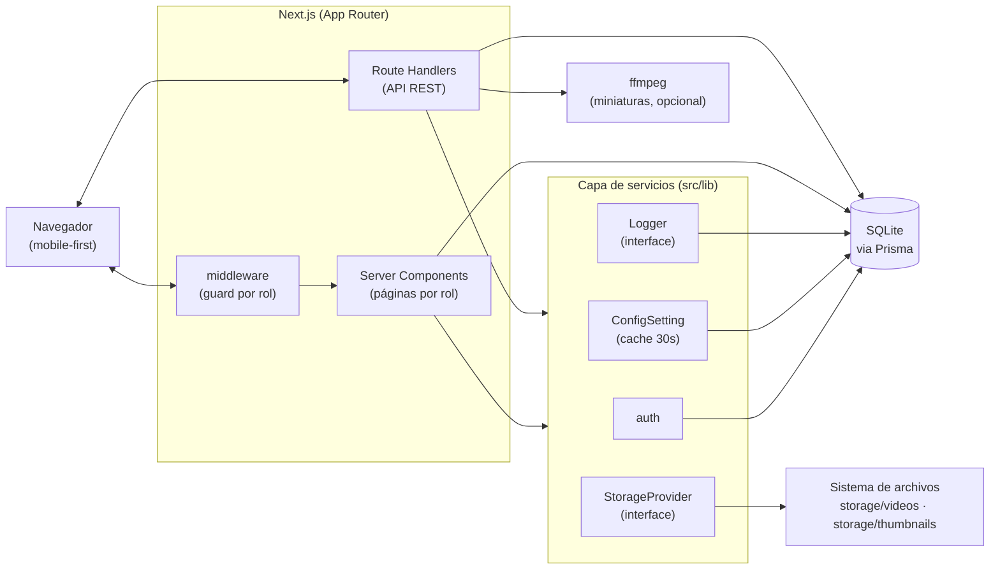
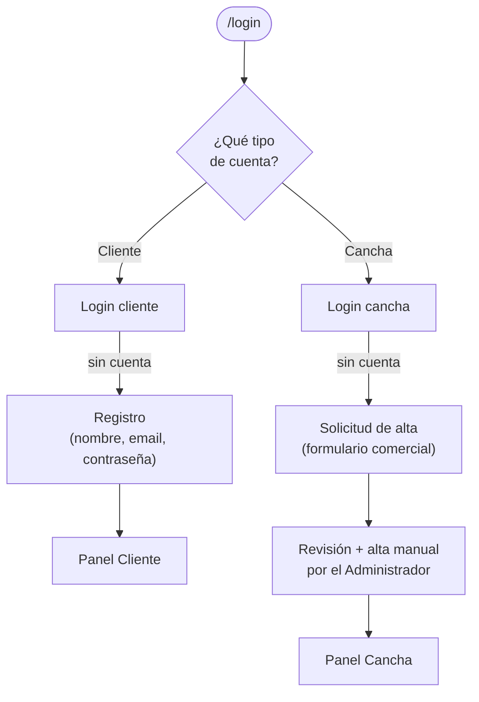
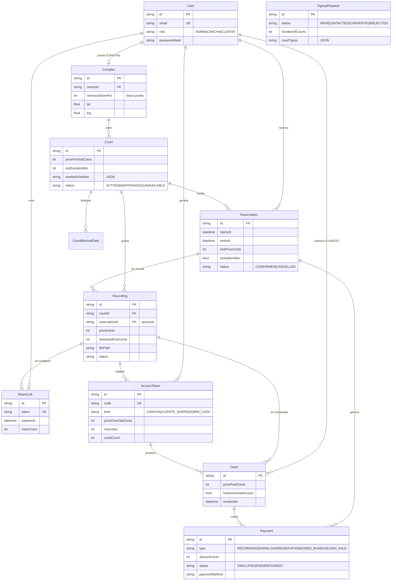
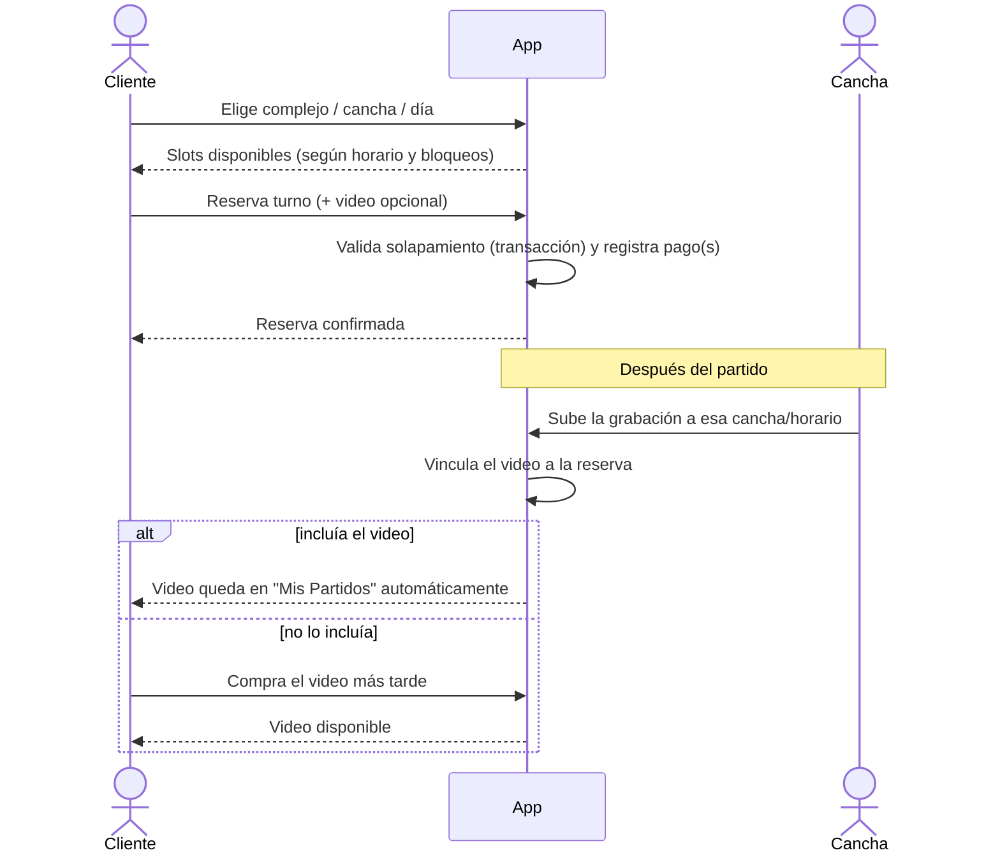
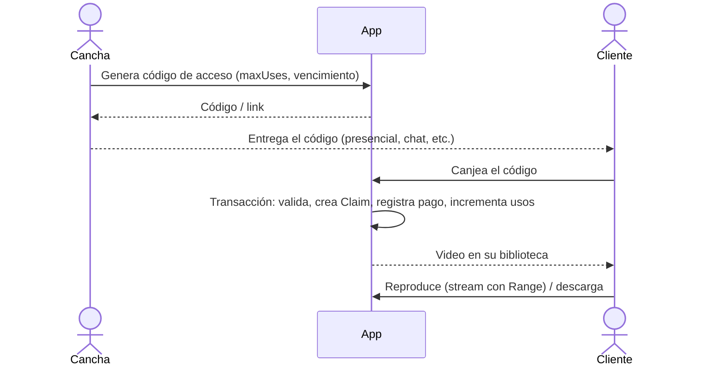
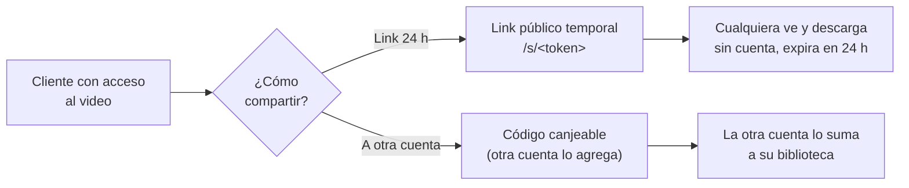

# Plataforma de Video para Complejos Deportivos

Aplicación web para que complejos deportivos graben los partidos de sus canchas, gestionen reservas de turnos y vendan/compartan los videos con los jugadores. Incluye reproducción en el navegador con streaming por rangos, descarga, links de acceso temporales y un panel de administración con métricas, configuración en vivo y herramientas de diagnóstico.

> **Estado: MVP (Fase 1).** Corre 100% local: base de datos SQLite y almacenamiento de video en el sistema de archivos. La arquitectura está pensada para migrar a la nube (Postgres + object storage) sin reescribir la lógica.

---

## Tabla de contenidos

- [Características](#características)
- [Stack tecnológico](#stack-tecnológico)
- [Arquitectura](#arquitectura)
- [Roles de usuario](#roles-de-usuario)
- [Modelo de datos](#modelo-de-datos)
- [Flujos principales](#flujos-principales)
- [Modelo de ingresos](#modelo-de-ingresos)
- [Pipeline de video](#pipeline-de-video)
- [Estructura del proyecto](#estructura-del-proyecto)
- [Referencia de API](#referencia-de-api)
- [Puesta en marcha](#puesta-en-marcha)
- [Configuración](#configuración)
- [Roadmap](#roadmap)

---

## Características

- **Autenticación por roles** (Administrador, Cancha, Cliente) con protección de rutas en middleware.
- **Reservas de turnos** con horario por día de la semana, estado operativo (disponible / mantenimiento / no disponible) y bloqueo de fechas puntuales.
- **Venta de videos**: la cancha genera códigos de acceso; el cliente los canjea y el video queda en su biblioteca.
- **Bundle reserva + video**: al reservar, el cliente puede sumar el video; cuando la cancha lo sube, queda vinculado automáticamente.
- **Reproductor HTML5** con streaming por rangos (seek + reproducción progresiva), descarga reanudable y miniaturas.
- **Compartir**: link público temporal (24 h, sin cuenta) y código para compartir el video con otras cuentas.
- **Panel de administración**: métricas globales por complejo, configuración en vivo, visor de logs y diagnóstico de almacenamiento.
- **Solicitudes de alta**: formulario público de captación de complejos y conversión a cuenta operativa desde el panel.
- **Pagos simulados** registrados como transacciones, listos para integrar un gateway real.

---

## Stack tecnológico

| Capa | Tecnología |
|------|------------|
| Framework | Next.js 14 (App Router) + TypeScript |
| UI | TailwindCSS (mobile-first), lucide-react |
| Base de datos | Prisma ORM + SQLite (portable a PostgreSQL) |
| Autenticación | Auth.js v5 (Credentials provider, sesión JWT), bcrypt |
| Validación | Zod en cada endpoint |
| Video | `<video>` HTML5 + API routes con soporte `Range` (206) |
| Miniaturas | ffmpeg (opcional, con fallback) |

---

## Arquitectura



**Decisiones de diseño:**

- El almacenamiento de video está detrás de una interface `StorageProvider` (implementación local hoy; S3/GCS en el futuro sin tocar el resto).
- El logging está detrás de una interface `Logger` (DB hoy; servicio externo después).
- El dinero se maneja siempre en **centavos enteros** (`Int`), nunca en flotantes.
- Los porcentajes de comisión se guardan en **basis points** (`7000` = 70,00 %).
- Los videos **no** se sirven como archivos estáticos públicos: pasan por route handlers que validan sesión y permiso de acceso.

---

## Roles de usuario



| Rol | Quién es | Puede |
|-----|----------|-------|
| **Administrador** | Operador de la plataforma | Métricas globales, configuración en vivo, logs, diagnóstico de storage, gestión de solicitudes de alta, alta de complejos, generación de códigos por venta en efectivo, ajuste de comisión por complejo. |
| **Cancha** | Dueño/encargado de un complejo | Gestiona sus canchas (precio, horario, estado, bloqueos), reservas, grabaciones (CRUD), genera códigos de acceso y ve sus métricas. |
| **Cliente** | Jugador | Reserva turnos, ve "Mis Partidos", reproduce y descarga videos, los comparte y canjea códigos. |

- El **Cliente** se autoregistra (alta instantánea).
- La **Cancha** no se autoregistra: envía una **solicitud de alta** que el Administrador revisa y convierte en cuenta tras el acuerdo comercial.
- El **Administrador** se provisiona internamente (seed / alta manual).

---

## Modelo de datos



Entidades de soporte: `ConfigSetting` (flags de negocio editables en vivo) y `Log` (auditoría/diagnóstico con retención automática).

---

## Flujos principales

### Reserva de turno + video opcional



### Acceso a un video por código



### Compartir un video ya adquirido



---

## Modelo de ingresos

Cada cobro se registra como `Payment` (la fuente de verdad de las métricas, sin doble conteo). La comisión de la plataforma se aplica **solo a video y descargas**; el **alquiler de cancha es 100 % del complejo**.

```
comisionable      = ingresos_video + ingresos_descargas
comision_plataforma = comisionable × (1 − revenueSharePct/10000)
ingreso_cancha    = ingresos_alquiler + comisionable × (revenueSharePct/10000)
```

| Tipo de pago | Origen | Entra al split |
|--------------|--------|----------------|
| `RESERVATION` | Alquiler del turno | No (100 % cancha) |
| `RECORDING` | Venta de video | Sí |
| `VIDEO_BUNDLE` | Video comprado junto a la reserva | Sí |
| `DOWNLOAD` | Adicional de descarga | Sí |
| `CASH_SALE` | Venta en efectivo registrada por Admin | Sí |

Las cancelaciones y revocaciones marcan los pagos como `REFUNDED`, que quedan excluidos de las métricas.

---

## Pipeline de video

- **Reproducción**: las route handlers respetan el header `Range` y responden `206 Partial Content` con el tramo exacto pedido (abierto `bytes=N-`, exacto `bytes=N-M` y sufijo `bytes=-N`). Esto habilita *seek* y reproducción progresiva; el navegador gestiona su propio buffer. Se incluyen `ETag`, `Last-Modified`, `If-Range` y soporte de `HEAD`.
- **Descarga reanudable**: la descarga también soporta `Range`, de modo que una transferencia interrumpida se retoma desde donde quedó.
- **Recursos**: al hacer seek/cancelar, el stream del archivo se cierra para no filtrar descriptores.
- **Miniaturas**: se generan on-demand con ffmpeg (un frame escalado), se cachean en disco y caen a un placeholder si ffmpeg no está disponible.
- **`faststart`**: el panel de diagnóstico detecta MP4 con el átomo `moov` al final (arranque lento) y sugiere re-multiplexar con ffmpeg.

> Para arranque inmediato, los MP4 deberían tener `faststart`:
> `ffmpeg -i entrada.mp4 -c copy -movflags +faststart salida.mp4`

---

## Estructura del proyecto

```
prisma/
  schema.prisma          # Modelo de datos + migraciones
  seed.ts                # Datos de prueba (un usuario por rol)
storage/
  videos/                # Archivos de video (gitignored)
  thumbnails/            # Miniaturas cacheadas (gitignored)
src/
  app/
    (público)            # landing, login, register, solicitar, /s/[token]
    cliente/             # dashboard, reservas, reservar, claim, player
    cancha/              # dashboard, canchas, grabaciones, accesos, reservas, métricas
    admin/               # dashboard, solicitudes, complejos, tokens, config, storage, logs
    api/                 # route handlers (REST)
  components/            # AppShell, VideoPlayer, VideoThumb, Pagination, MetricCard, ...
  lib/
    auth.ts / auth.config.ts   # Auth.js (config edge-safe para middleware)
    db.ts                      # PrismaClient singleton
    storage/                   # StorageProvider + implementación local
    videoResponse.ts           # Respuestas con Range/ETag/HEAD
    thumbnail.ts               # Generación de miniaturas (ffmpeg)
    mp4.ts                     # Detección de faststart
    queries.ts                 # Métricas (desde Payment)
    config.ts                  # ConfigSetting con cache
    logger.ts                  # Logger + retención
    slots.ts / courtSchedule.ts # Disponibilidad y horarios
    money.ts / geo.ts / tokens.ts / rate-limit.ts
  middleware.ts          # Protección de rutas por rol
```

---

## Referencia de API

| Método | Ruta | Rol | Descripción |
|--------|------|-----|-------------|
| POST | `/api/register` | público | Alta de cliente |
| `*` | `/api/auth/*` | público | Auth.js (login/logout/sesión) |
| POST | `/api/signup-request` | público | Solicitud de alta de complejo |
| POST | `/api/tokens/redeem` | cliente | Canjear código de acceso |
| GET/HEAD | `/api/recordings/[id]/stream` | autenticado | Streaming con `Range` |
| GET/HEAD | `/api/recordings/[id]/download` | con acceso | Descarga (reanudable) |
| GET | `/api/recordings/[id]/thumbnail` | con acceso | Miniatura (on-demand) |
| POST | `/api/recordings/[id]/buy-download` | cliente | Pagar adicional de descarga |
| POST | `/api/recordings/[id]/share` | con acceso | Crear link público 24 h |
| POST | `/api/recordings/[id]/share-account` | cliente | Código para otra cuenta |
| GET/HEAD | `/api/share/[token]/stream` · `/download` | público | Acceso vía link temporal |
| POST | `/api/reservations` | cliente | Crear reserva |
| POST | `/api/reservations/[id]/cancel` | cliente/cancha | Cancelar (con ventana mínima) |
| POST | `/api/reservations/[id]/buy-video` | cliente | Comprar el video de la reserva |
| GET | `/api/courts/[id]/availability` | autenticado | Slots disponibles por fecha |
| POST/PATCH/DELETE | `/api/cancha/courts/[id]*` | cancha | Gestión de canchas y bloqueos |
| POST/PATCH/DELETE | `/api/cancha/recordings*` | cancha | CRUD de grabaciones |
| POST | `/api/cancha/tokens` | cancha | Generar código de acceso |
| POST | `/api/cancha/claims/[id]/revoke` | cancha/admin | Revocar acceso de un cliente |
| PATCH | `/api/admin/complejos/[id]` | admin | Comisión y ubicación |
| POST | `/api/admin/tokens` | admin | Código por venta en efectivo |
| PATCH/POST | `/api/admin/solicitudes/[id]*` | admin | Gestionar/convertir solicitudes |
| GET/PUT/DELETE | `/api/admin/config` | admin | Configuración en vivo |
| POST | `/api/admin/logs/cleanup` | admin | Limpieza manual de logs |

---

## Puesta en marcha

**Requisitos:** Node.js 20+, pnpm. ffmpeg es opcional (solo para miniaturas).

```bash
cp .env.example .env        # variables de entorno
pnpm install
pnpm dev                    # aplica migraciones, genera el client y levanta el server
```

Abrir http://localhost:3000

> `pnpm dev` ejecuta un hook `predev` que corre `prisma migrate deploy && prisma generate`, así la base y el client siempre quedan en sync tras un `git pull`.

Para probar la reproducción, copiar un `.mp4` a `storage/videos/` y referenciarlo al crear una grabación.

**Cuentas de prueba:** el seed crea un usuario por cada rol. Ver credenciales en `prisma/seed.ts` (se imprimen al correr `pnpm db:seed`).

**Scripts útiles:**

| Script | Acción |
|--------|--------|
| `pnpm dev` | Desarrollo (migra + genera + server) |
| `pnpm build` / `pnpm start` | Build de producción / servir |
| `pnpm db:migrate` | Crear/aplicar migración de desarrollo |
| `pnpm db:seed` | Cargar datos de prueba |
| `pnpm db:reset` | Reiniciar la base y re-seedear |
| `pnpm db:studio` | Explorador visual de la base |

---

## Configuración

**Variables de entorno** (`.env`):

| Variable | Descripción |
|----------|-------------|
| `DATABASE_URL` | Conexión a la base (SQLite local; Postgres en producción) |
| `AUTH_SECRET` | Secreto de Auth.js |
| `VIDEO_STORAGE_PATH` | Carpeta de videos |
| `THUMBNAIL_STORAGE_PATH` | Carpeta de miniaturas |
| `APP_BASE_URL` | URL base de la app |

**Configuración en vivo** (`ConfigSetting`, editable desde el panel de Admin, cache de 30 s): precio y fee de descarga por defecto, comisión por defecto, ventana mínima de cancelación, retención de logs, entre otros. Los secretos de infraestructura viven solo en `.env`.

---

## Roadmap

**Incluido (Fase 1):** roles y auth, reservas con horarios/estados/bloqueos, venta y compartición de videos, streaming optimizado, miniaturas, métricas e ingresos, panel de administración, solicitudes de alta, pagos simulados.

**Próximas fases:**

- Almacenamiento en la nube (la interface `StorageProvider` ya lo abstrae).
- Pagos reales (la tabla `Payment` ya contempla referencia externa y método).
- Notificaciones por email (altas, recordatorios de reserva).
- Subida de video directa desde el panel (hoy se referencia un archivo ya colocado).
- Análisis con IA, transmisión en vivo y funciones sociales.
